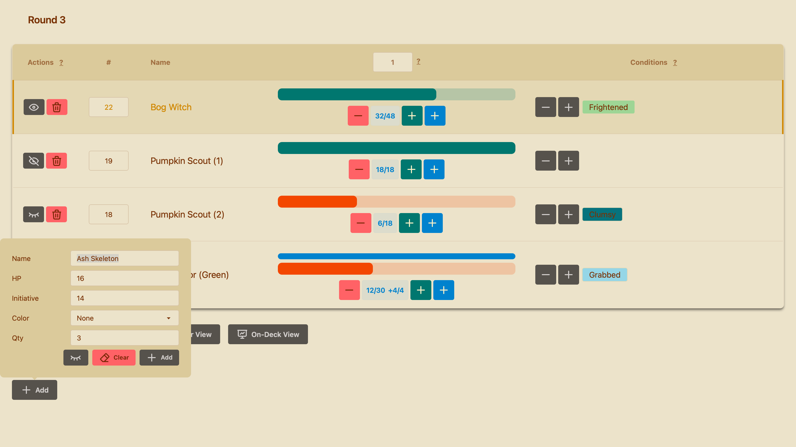
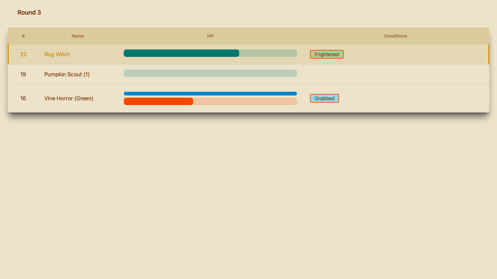
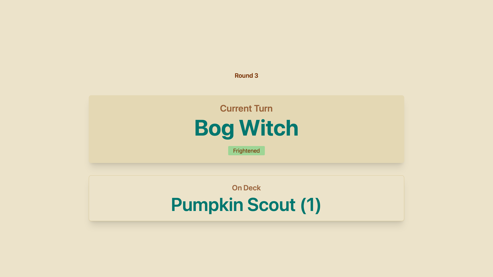
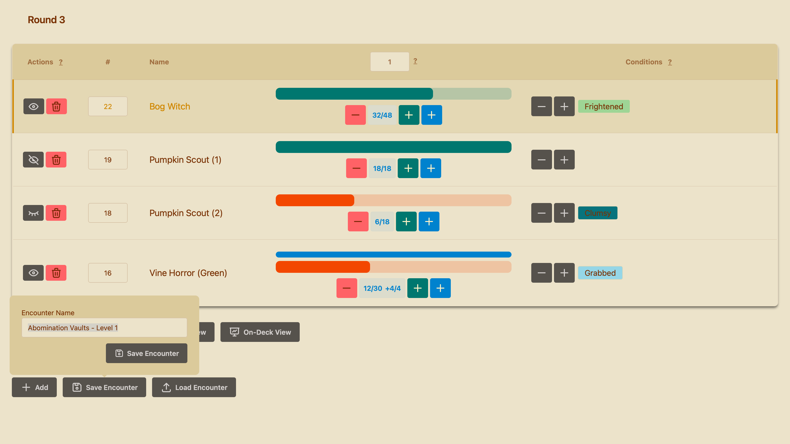
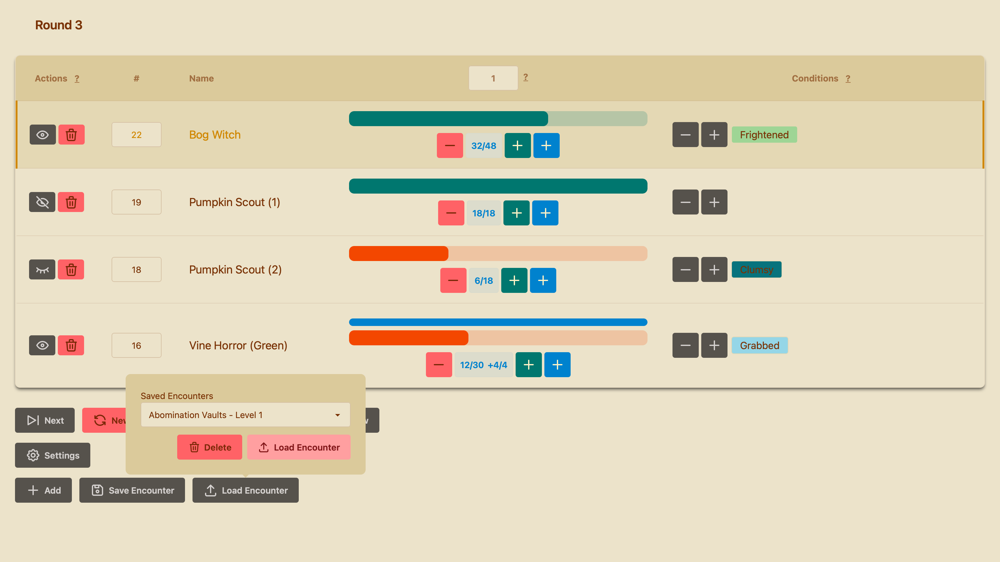

# 🎲 Pathfinder 2e Initiative Tracker


A modern, themeable initiative tracker for Pathfinder 2e combat encounters with separate DM and player views. Built with Vue 3, TypeScript, and Tailwind CSS. 

**[🎮 Live Demo](https://seroph386.github.io/init-tracker/)**

Maintained by Seroph386 as a divergent rework of [Gabriel Valforte's initiative-tracker](https://github.com/Valforte/initiative-tracker). Credit to the original project for the foundation and inspiration, but treat this repository as its own actively maintained solution.

## DM View


## Player View


## On-Deck View



## Features

### Core Functionality
- ⚔️ **Combat Management**: Track initiative order, HP (including temporary HP), and turn progression
- 👁️ **Three-Tier Visibility System**: Control what players see (hidden/name-only/full HP visibility)
- 🎯 **Condition Tracking**: Add, modify, and remove conditions with auto-generated color-coding
- 🔄 **Dual View System**: Separate interfaces for DM (full control) and players (read-only)
- 💾 **Auto-Save**: All combat state persists automatically to localStorage
- 🌐 **Online Mode (Optional)**: Enable real-time multiplayer sync using Firebase or a self-hosted SQLite server, including a single-container Docker Compose deployment - [Firebase Quick Start](docs/ONLINE_MODE_QUICK_START.md) / [SQLite Self-Hosting](docs/SELF_HOSTED_SQLITE.md)

### Customization
- 🎨 **35+ Themes**: Choose from a wide variety of DaisyUI themes with live preview
- 🌍 **Bilingual**: Full support for English and Brazilian Portuguese
- 📱 **Responsive Design**: Works on desktop and mobile devices

### DM Features
- Add/remove combatants with customizable visibility
- Modify HP with configurable increment values
- Manage temporary HP separately from regular HP
- Bulk spawn multiple creatures with optional color and number naming
- Add and track conditions with values (e.g., "Frightened 2")
- Save named encounter snapshots with combatants, HP, temporary HP, conditions, initiative, and visibility
- Integrated monster list from Pathfinder 2e Monster Core and Age of Ashes
- Quick reference help tooltips for all major features

### Player Features
- Clean, distraction-free view of combat
- See only combatants the DM has made visible
- View HP bars and conditions (respecting visibility settings)
- Click conditions to see descriptions (when available)
- Real-time updates via localStorage synchronization

## Technology Stack

- **Vue 3** with `<script setup>` SFCs
- **TypeScript** (strict mode)
- **Vite** for build tooling
- **Tailwind CSS v4** with DaisyUI for styling
- **Reka UI** for advanced components
- **VueUse** for localStorage persistence
- **Iconify** for icons

## Installation

### Prerequisites
- Node.js (v18 or higher recommended)
- pnpm (or npm/yarn)

### Setup

```bash
# Clone the repository
git clone https://github.com/Seroph386/init-tracker.git
cd init-tracker

# Install dependencies
pnpm install

# Start development server
pnpm dev
```

The app will be available at `http://localhost:5173`

### Build for Production

```bash
# Type-check and build
pnpm build

# Preview production build
pnpm preview
```

Build output is generated in the `./dist` directory.

### Run with Docker Compose

The fastest self-hosted setup is a single container that serves the built app and stores online sessions in SQLite:

```bash
docker compose up --build
```

Then open `http://localhost:8787`.

This starts:
- The frontend app
- The SQLite realtime sync server
- A persistent Docker volume for the SQLite database

The bundled frontend is built with `VITE_SQLITE_SYNC_URL=/`, so enabling online mode in the Docker deployment uses the same container for both the UI and SQLite sync API.

See [docs/SELF_HOSTED_SQLITE.md](docs/SELF_HOSTED_SQLITE.md) for environment variables, volume details, and deployment notes.

### Pull a Published Image

If you publish the container through GitHub Actions, you can pull it from GitHub Container Registry:

```bash
docker pull ghcr.io/seroph386/init-tracker:latest
docker run -p 8787:8787 -v init-tracker-data:/app/data ghcr.io/seroph386/init-tracker:latest
```

Published images are now built for both `linux/amd64` and `linux/arm64`, so Apple Silicon and other ARM hosts can pull the same tag.

If you publish under a different GitHub `owner/repo`, replace `seroph386/init-tracker` with your own image path.

### Docker Compose from a Published Image

If you prefer not to build locally, create a `compose.yml` that references a published image directly.

#### Option A: SQLite in the same container (self-hosted online mode)

```yaml
services:
  init-tracker:
    image: ghcr.io/seroph386/init-tracker:latest
    ports:
      - "8787:8787"
    environment:
      SQLITE_SYNC_HOST: 0.0.0.0
      SQLITE_SYNC_PORT: 8787
      SQLITE_SYNC_DB_PATH: /app/data/initiative-tracker.sqlite
      SQLITE_SYNC_STATIC_DIR: /app/dist
      SQLITE_SYNC_STATIC_BASE_PATH: /
    volumes:
      - init-tracker-data:/app/data
    restart: unless-stopped

volumes:
  init-tracker-data:
```

#### Option B: Firebase frontend image (no local SQLite state)

The published image is built with `VITE_SQLITE_SYNC_URL=/` and can always use SQLite mode. To run Firebase mode from a container, build an image with Firebase `VITE_FIREBASE_*` values at build time and no `VITE_SQLITE_SYNC_URL`, then reference that image in compose:

```yaml
services:
  init-tracker:
    image: ghcr.io/<owner>/<firebase-tag>
    ports:
      - "8787:8787"
    restart: unless-stopped
```

Use the DM Settings panel to choose Firebase once the app is running.

## Usage

### DM View (Default)
When you open the app normally, you'll see the DM interface with full controls:

1. **Add Combatants**: Click the "Add" button to create new combatants
   - Enter name, HP, and initiative
   - Optionally choose a color suffix or use `None` for plain numbering
   - Set visibility level (eye icons)
   - Use quantity field to spawn multiple creatures at once
   - Autocomplete suggestions from Monster Core database

2. **Manage HP**:
   - Set the increment value in the HP column header
   - Click minus (-) to damage, green plus (+) to heal
   - Blue plus (+) adds temporary HP
   - Click the HP display button to heal to max and reset temporary HP
   - Right-click HP display to set max HP to the configured value, very handy when a player level up

3. **Track Conditions**:
   - Click plus (+) to add a new condition
   - Click minus (-) to reduce all conditions by 1
   - Click a condition badge to reduce it by 1
   - Right-click a condition badge to increase it by 1
   - Autocomplete from official Pathfinder 2e conditions

4. **Control Visibility**:
   - 👁️ Full: Players see everything including HP bar (For PCs)
   - 👁️‍🗨️ Half: Players see name and initiative, but not HP (For NPCs)
   - 🚫 Hidden: Combatant is hidden from players and skipped in turn order (For DM planning)

5. **Advance Combat**:
   - Click "Next" to advance to the next turn
   - Click "New Combat" to reset round and turn counters

6. **Save and Reuse Encounters**:
   - Click "Save Encounter" to open a pop-up and store the current encounter as a named snapshot
   - Click "Load Encounter" to restore a saved encounter as the active combat
   - Use the same load pop-up to delete saved encounters you no longer need
   - Saved encounters preserve combatants, initiative, current/max HP, temporary HP, conditions, and player visibility
   - Loading an encounter replaces the current combat and resets turn/round tracking to the start

### Player View
To display the standard player table view, add `?view=player` to the URL or click the Player View button:
```
http://localhost:5173/?view=player
```

Players will see:
- Initiative order
- Combatant names (respecting visibility)
- HP bars (only for Full visibility combatants)
- Conditions with descriptions
- Current turn highlighted
- No controls or hidden information

**Tip**: Open the player view on a separate screen. Both views share the same localStorage, so changes update in real-time.

### Encounter Snapshots
The DM view includes dedicated pop-ups for saving and loading encounters, keeping the main control area compact while still making reusable setups quick to manage.

| Save Encounter | Load Encounter |
| --- | --- |
|  |  |

### On-Deck View
Use On-Deck mode when you want a cleaner presentation screen that only emphasizes the current turn and who is next:
```
http://localhost:5173/?view=on-deck
```


You can open it in one of two ways:
- Click the **On-Deck View** button from the DM interface when playing locally
- Copy the generated On-Deck URL in online mode and share that link with a display device or stream overlay

On-Deck mode shows:
- The current round
- The active combatant in large text
- The next combatant underneath
- Name colors that reflect each visible combatant's current HP state when HP is visible to players

This mode works especially well for TVs, projectors, and OBS/browser-source overlays where the full initiative table would be too busy.

### Online Mode (Optional)

Enable real-time multiplayer sync to share combat sessions with remote players:

1. **Toggle Online Mode**: Click the "Online Mode" toggle in the DM view
2. **Choose Backend**: Select Firebase or SQLite in Settings before enabling it
3. **Share URL**: Click "Copy Player URL" and send it to your players
4. **Real-time Sync**: All changes are instantly visible to all connected players

Setup guides:
- [Firebase Quick Start](docs/ONLINE_MODE_QUICK_START.md)
- [Self-Hosted SQLite Setup](docs/SELF_HOSTED_SQLITE.md)

**Benefits**:
- Perfect for remote/hybrid games
- No need for screen sharing
- Players get their own clean interface
- Works alongside in-person play
- Can be fully self-hosted without depending on Google/Firebase

### Multi-Table Setup
If you need to run multiple tables simultaneously:
- Use different browsers or incognito windows (localStorage is per-origin)
- Or deploy multiple instances with different base URLs

## Pathfinder 2e Integration

This tracker is specifically designed for [Pathfinder 2e](https://paizo.com/pathfinder) by Paizo Inc. It includes:
- Pre-loaded monster database from Monster Core and Age of Ashes AP
- Official condition names and descriptions in English and Portuguese
- Temporary HP tracking (common in PF2e)
- Multi-stage conditions (e.g., Dying 1, 2, 3)

While built for PF2e, the tracker can be adapted for any d20 system or tabletop RPG.

## Contributing

Contributions are welcome! Please read [CONTRIBUTING.md](docs/CONTRIBUTING.md) for guidelines on how to contribute to this project.

## License

This project is licensed under the MIT License - see the [LICENSE](LICENSE) file for details.

## Acknowledgments

- Built with [Vue 3](https://vuejs.org/), [Tailwind CSS](https://tailwindcss.com/), and [DaisyUI](https://daisyui.com/)
- Icons by [Iconify](https://iconify.design/)
- Monster data from Pathfinder 2e Monster Core and Age of Ashes Adventure Path
- Original project foundation by [Gabriel Valforte](https://github.com/Valforte) via [initiative-tracker](https://github.com/Valforte/initiative-tracker)
- Inspired by the need for a clean, modern initiative tracker for in-person play

## Support

If you encounter any issues or have suggestions:
- Open an issue on [GitHub Issues](https://github.com/Seroph386/init-tracker/issues)
- Check existing issues to avoid duplicates
- Provide as much detail as possible (browser, steps to reproduce, screenshots)

---

Made with ❤️ for the Pathfinder community
